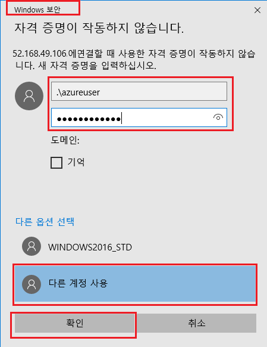
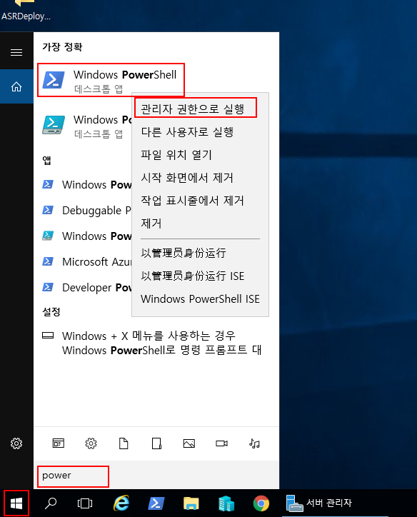
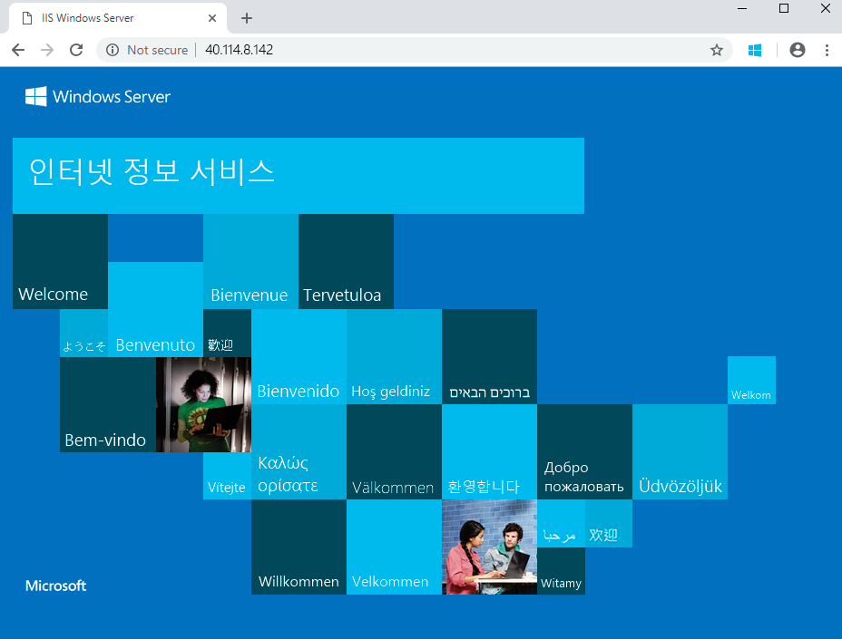

---
wts:
    title: '01 - 포털에서 가상 머신 만들기'
    module: '모듈 02 - 핵심 Azure 서비스(워크로드)'
---
# 01 - 포털에서 가상 머신 만들기

이 연습에서는 Azure Portal에서 가상 머신을 만들고 이 가상 머신에 연결하여 웹 서버 역할을 설치하고 테스트합니다. 

**참고**: 이 연습을 수행하는 동안 정보 아이콘을 클릭하고 읽으세요. 

# 작업 1: Azure 가상 머신 만들기

이 작업에서는 Windows Server 2019 Datacenter - Gen1 가상 머신을 만듭니다. 

1. [Azure Portal(https://portal.azure.com)](https://portal.azure.com?azure-portal=true)에 로그인합니다.

2. **모든 서비스** 블레이드에서 **가상 머신**을 검색하여 선택한 다음 **+ 추가**를 클릭하고 **+가상 머신**을 선택합니다.

3. **기본** 탭에서 다음 정보를 채웁니다(다른 항목은 기본값을 사용).

    | 설정 | 값 |
    |  -- | -- |
    | 구독 | **보유한 구독 선택**|
    | 리소스 그룹 | **myRGVM**(새로 만들기) |
    | 가상 머신 이름 | **myVm** |
    | 위치 | **(미국) 미국 동부**|
    | 이미지 | **Windows Server 2019 Datacenter - Gen1**|
    | 크기 | 표준 D2s v3|
    | 관리자 계정 사용자 이름 | **azureuser** |
    | 관리자 계정 암호 | **Pa$$w0rd1234**|
    | 인바운드 포트 규칙 - 포트 선택 허용 | **RDP(3389)** 및 **HTTP(80)**|
    | | |

4. 네트워킹 탭으로 전환하고 **인바운드 포트 선택**을 찾습니다.

    | 설정 | 값 |
    | -- | -- |
    | 인바운드 포트 선택 | **HTTP (80), RDP (3389)**|
    | | |

5. 관리 탭으로 전환하고 **모니터링** 섹션에서 다음 설정을 선택합니다.

    | 설정 | 값 |
    | -- | -- |
    | 부팅 진단 | **사용 안 함**|
    | | |

6. 나머지 기본값을 그대로 유지한 다음 페이지 하단에 있는 **검토 + 만들기** 단추를 클릭합니다.

7. 유효성 검사가 통과되면 **만들기** 단추를 클릭합니다. 가상 머신을 배포하는 데 약 5~7분이 걸릴 수 있습니다.

8. 배포 페이지와 **알림** 영역(상단 메뉴의 종 아이콘)을 통해 업데이트가 제공됩니다.
* 포트 80이 열렸는지 확인합니다. 

# 작업 2: 가상 머신에 연결

이 작업에서는 RDP를 사용하여 새 가상 머신에 연결합니다. 

1. **myVM**을 검색하고 새 가상 머신을 선택합니다.

    **참고**: 배포 페이지에 있는 **리소스로 이동** 링크 또는 **알림** 영역의 리소스 링크를 클릭할 수도 있습니다.

2. 가상 머신의 **개요** 블레이드에서 **연결** 단추를 클릭하고 **RDP**를 선택합니다.

    

    **참고**: 다음 지침은 Windows 컴퓨터에서 VM에 연결하는 방법을 알려줍니다. Mac에서는 Mac App Store의 원격 데스크톱 클라이언트와 같은 RDP 클라이언트가 필요하고, Linux 컴퓨터에서는 오픈 소스 RDP 클라이언트를 사용할 수 있습니다.

2. **가상 머신에 연결** 페이지에서 포트 3389를 통해 공용 IP 주소에 연결하는 기본 옵션을 유지하고 **RDP 파일 다운로드**를 클릭합니다.

3. 다운로드된 RDP 파일을 **열고** 메시지가 표시되면 **연결**을 클릭합니다. 

    

4. **Windows 보안** 창에서 **다른 옵션 선택**을 선택한 다음 **다른 계정 사용**을 선택합니다. 사용자 이름(.\azureuser)과 암호(Pa$$w0rd1234)를 제공합니다. **확인**을 클릭하여 연결합니다.

    

5. 로그인 프로세스 중에 인증서 경고가 표시될 수 있습니다. **예**를 클릭하거나 연결을 생성하고 배포된 VM에 연결합니다. 성공적으로 연결해야 합니다.

    

축하합니다. Azure의 Windows Server 가상 사스템을 배포하고 연결했습니다

# 작업 3: 웹 서버 역할 설치 및 테스트

이 작업에서는 서버에 웹 서버 역할을 설치하고 기본 IIS 시작 페이지가 표시되는지 확인합니다.

1. 가상 머신에서 PowerShell 명령 프롬프트를 엽니다. **시작** 단추를 클릭하고 **PowerShell**을 입력하고 **Windows PowerShell**을 마우스 오른쪽 단추로 클릭하고 오른쪽 클릭 메뉴에서 **관리자로 실행**을 클릭하면 됩니다.

    

2. PowerShell 명령 프롬프트에서 다음 명령을 실행하여 가상 머신에 **Web-Server** 기능을 설치합니다. 이 명령을 복사하여 붙여 넣을 수 있습니다.

    ```PowerShell
    Install-WindowsFeature -name Web-Server -IncludeManagementTools
    ```
  
3. 명령을 완료하면 **Success** 메시지와 **True** 값이 표시됩니다. 설치를 완료하기 위해 가상 머신을 다시 시작하지 않아도 됩니다. VM에 대한 RDP 연결을 닫습니다.

    

4. 포털로 돌아가서 myVM의 **개요** 블레이드로 다시 이동하고, **클립보드에 복사** 단추를 사용하여 myVM의 공용 IP 주소를 복사하고, 새 브라우저 탭을 열고, 공용 IP 주소를 URL 텍스트 상자에 붙여 넣고, **Enter** 키를 눌러서 이동합니다.

    

5. 기본 IIS 웹 서버 시작 페이지가 열립니다.

    

축하합니다. 공용 IP 주소를 통해 액세스할 수 있는 웹 서버를 만들었습니다. 호스트할 웹 애플리케이션이 있는 경우 애플리케이션 파일을 가상 시스템에 배포하고 배포된 가상 머신에서 공용 액세스를 위해 호스트할 수 있습니다.


**참고**: 추가 비용을 방지하려면 이 리소스 그룹을 제거할 수 있습니다. 리소스 그룹을 검색하고 리소스 그룹을 클릭한 다음 **리소스 그룹 삭제**를 클릭합니다. 리소스 그룹의 이름을 확인한 다음 **삭제**를 클릭합니다. **알림**을 모니터링하여 삭제가 성공적으로 완료되었는지 확인합니다. 
