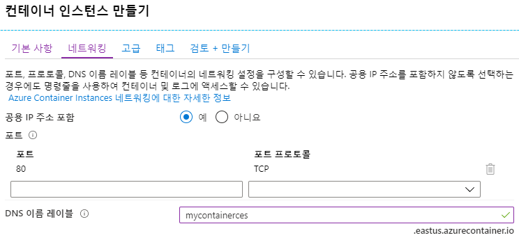
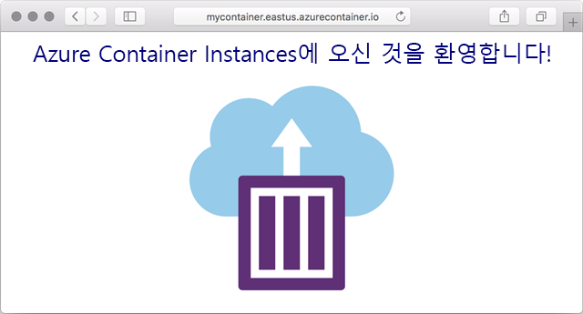

---
wts:
    title: '03 - Azure Container Instances 배포(10분)'
    module: '모듈 02 - 핵심 Azure 서비스(워크로드)'
---

# 03 - Azure Container Instances 배포

이 연습에서는 Azure Portal에서 ACI(Azure Container Instances)를 사용하여 Docker 컨테이너를 생성, 구성 및 배포합니다. 이 컨테이너는 정적 HTML 페이지를 표시하는 ACI 시작 웹 애플리케이션입니다. 

# 작업 1: 컨테이너 인스턴스 만들기(10분)

이 작업에서는 웹 애플리케이션에 대한 새 컨테이너 인스턴스를 만듭니다. 

1. [Azure Portal](https://portal.azure.com)에 로그인합니다.

2. **모든 서비스** 블레이드에서 **컨테이너 인스턴스**를 검색하여 선택한 다음 **+ 추가, + 만들기 또는 + 새로 만들기**를 클릭합니다. 

3. 새로운 컨테이너 인스턴스를 위해 다음과 같은 기본 정보를 제공합니다(그 외 항목은 기본값으로 둡니다). 

	| 설정| 값|
	|----|----|
	| 구독 | **보유한 구독 선택** |
	| 리소스 그룹 | **myRGContainer**(새로 만들기) |
	| 컨테이너 이름| **mycontainer**|
	| 지역 | **(미국) 미국 동부** |
	| 이미지 원본| **Docker Hub 또는 다른 레지스트리**|
	| 이미지 유형| **공용**|
	| 이미지| **microsoft/aci-helloworld**|
	| OS 유형| **Linux** |
	| 크기| ***기본값 유지***|
	|||

4. 네트워킹 탭을 구성합니다(**xxxx**를 문자와 숫자로 대체하여 이름을 전역적으로 고유하게 지정). 다른 모든 설정은 기본값으로 유지합니다.

	| 설정| 값|
	|--|--|
	| DNS 이름 레이블| **mycontainerdnsxxxx** |
	|||
	
	**참고**: dns-name-label.region.azurecontainer.io에서 컨테이너에 공개적으로 연결할 수 있습니다. 배포 후 **DNS 이름 레이블을 사용할 수 없음**이라는 오류 메시지가 표시되면 다른 DNS 이름 레이블(xxxx를 사용하면 안 됨)을 지정하고 다시 배포하세요. 

	

5. **검토 후 만들기**를 클릭하여 자동 유효성 검사 프로세스를 시작합니다.

6. **만들기**를 클릭하여 컨테이너 인스턴스를 만듭니다. 

7. 배포 페이지 및 **알림** 페이지를 모니터링합니다. 

8. 기다리는 동안 [이 샘플 애플리케이션의 샘플 코드](https://github.com/Azure-Samples/aci-helloworld)를 확인해 보세요. \app 폴더로 이동합니다. 

# 작업 2: 컨테이너 인스턴스 배포 확인

이 작업에서는 시작 페이지가 표시되는지를 확인함으로써 컨테이너 인스턴스가 실행 중인지 확인합니다.

1. 배포가 완료된 후에 배포 블레이드에 있는 **리소스로 이동** 링크 또는 알림 영역의 리소스 링크를 클릭합니다.

2. **mycontainer** 의 **개요** 페이지에서 컨테이너 **상태**가 **실행 중**인지 확인합니다. 

3. FQDN(정규화된 도메인 이름)을 찾습니다.

	

2. 컨테이너의 FQDN을 URL 텍스트 상자 브라우저에 복사하고 **Enter** 키를 누릅니다. 시작 페이지가 표시됩니다. 

	

**참고**: 브라우저에서 컨테이너 IP 주소를 사용할 수도 있습니다. 

축하합니다. Azure Portal을 사용하여 Azure Container Instance의 컨테이너에 애플리케이션을 성공적으로 배포했습니다.

**참고**: 이 리소스 그룹을 제거해 추가 비용이 발생하는 것을 방지할 수 있습니다. 리소스 그룹을 검색하고 리소스 그룹을 클릭한 다음 **리소스 그룹 삭제**를 클릭합니다. 리소스 그룹의 이름을 확인한 다음 **삭제**를 클릭합니다. **알림**을 모니터링하여 삭제가 어떻게 진행되는지 확인합니다.
