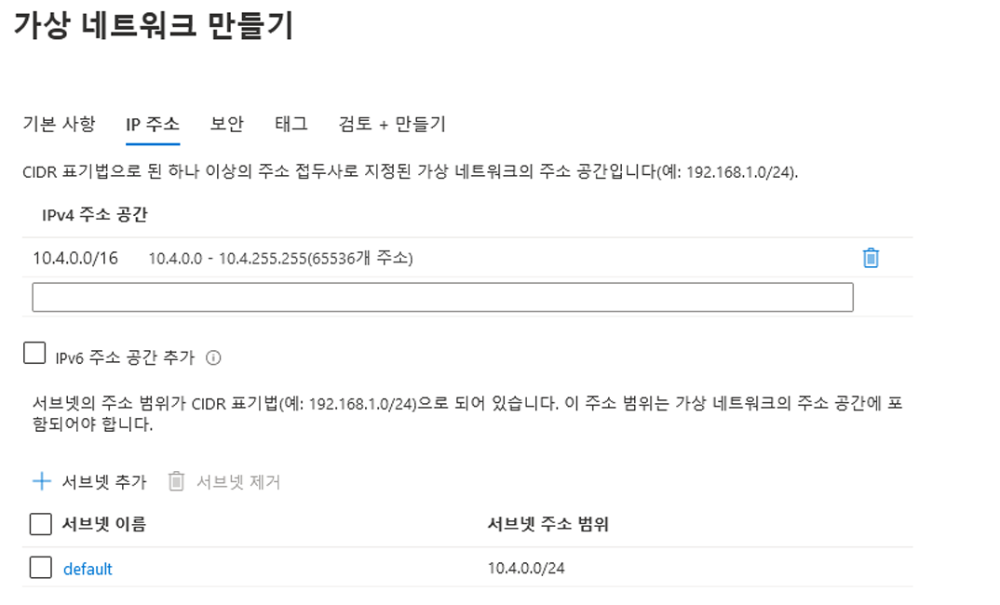

---
wts:
    title: '04 - 가상 네트워크 만들기(20분)'
    module: '모듈 02 - 핵심 Azure 서비스(워크로드)'
---
# 04 - 가상 네트워크 만들기

이 연습에서는 가상 네트워크를 만들고 두 개의 가상 머신을 해당 가상 네트워크에 배포한 다음 해당 가상 네트워크 내에서 한 가상 머신이 다른 가상 머신을 ping할 수 있도록 합니다.

# 작업 1: 가상 네트워크 만들기(20분)

이 작업에서는 가상 네트워크를 만듭니다. 

1. Azure Portal에 로그인합니다. <a href="https://portal.azure.com" target="_blank"><span style="color: #0066cc;" color="#0066cc">https://portal.azure.com</span></a>

2. **모든 서비스** 블레이드에서 **가상 네트워크**를 검색하여 선택한 다음 **+ 추가, + 만들기 또는 + 새로 만들기**를 클릭합니다. 

3. **가상 네트워크 만들기** 블레이드에서 다음 항목을 입력합니다(그 외 항목은 기본값으로 둡니다).

    | 설정 | 값 | 
    | --- | --- |
    | 구독 | **보유한 구독 선택** |
    | 리소스 그룹 | **myRGVNet**(새로 만들기) |
    | 이름 | **vnet1** |
    | 위치 | **(미국) 미국 동부** |
    | 주소 공간 |**10.1.0.0/16** |
    | 서브넷 - 이름 | **default** |
    | 서브넷 주소 범위 | **10.1.0.0/24** |

    
    

5. **검토 + 만들기** 단추를 클릭합니다. 유효성 검사에 통과하는지 확인합니다.

6. **만들기** 단추를 클릭하여 가상 네트워크를 배포합니다. 

    **참고**: 조직에서 필요한 가상 네트워크와 IP 주소 지정을 확인하려면 어떻게 해야 합니까?

# 작업 2: 가상 머신 2개 만들기

이 작업에서는 가상 네트워크에서 2개의 가상 머신을 만듭니다. 

1. **모든 서비스** 블레이드에서 **가상 머신**을 검색한 다음 **+ 추가**를 클릭하고 **+가상 머신**을 선택합니다. 

2. **기본** 탭에서 다음 정보를 채웁니다(다른 항목은 기본값을 사용).

   | 설정 | 값 | 
   | --- | --- |
   | 구독 | **보유한 구독 선택**  |
   | 리소스 그룹 |  **myRGVNet** |
   | 가상 머신 이름 | **vm1**|
   | 지역 | **(미국) 미국 동부** |
   | 이미지 | **Windows Server 2019 Datacenter** |
   | 사용자 이름| **azureuser** |
   | 암호| **Pa$$w0rd1234** |
   | 공용 인바운드 포트| **선택한 포트 허용** 선택  |
   | 선택한 인바운드 포트| **RDP(3389)** |
   |||

3. **네트워킹** 탭을 선택합니다. 가상 머신이 vnet1 가상 네트워크에 있는지 확인합니다. 기본 설정을 검토하되 변경은 하지 마세요. 

   | 설정 | 값 | 
   | --- | --- |
   | 가상 네트워크 | **vnet1** |
   |||

4. **검토 + 만들기**를 클릭합니다. 유효성 검사에 통과한 후 **만들기**를 클릭합니다. 배포 시간은 다양할 수 있지만 일반적으로 배포하는 데 3~6분이 걸릴 수 있습니다.

5. 배포를 모니터링하면서 다음 단계로 계속합니다. 

6. 위의 **2~4** 단계를 반복하여 두 번째 가상 머신을 만듭니다. 다른 가상 머신 이름을 사용하고, 가상 머신이 새 가상 네트워크 안에 있는지 그리고 새 공용 IP 주소를 사용하고 있는지 확인합니다.

    | 설정 | 값 |
    | --- | --- |
    | 리소스 그룹 | **myRGVNet** |
    | 가상 머신 이름 |  **vm2** |
    | 가상 네트워크 | **vnet1** |
    | 공용 IP | (신규) **vm2-ip** |
    |||

7. 두 가상 머신 모두가 배포될 때까지 기다립니다. 

# 작업 3: 연결 테스트 

이 작업에서는 한 VM에 로그인하여 다른 VM을 ping할 수 있도록 허용합니다. 

1. **모든 리소스** 블레이드에서 **vm1**을 검색하고, **개요** 블레이드를 열고, **상태**가 **실행 중**인지 확인합니다. 페이지를 **새로 고침**해야 할 수 있습니다.

2. **개요** 블레이드에서 **연결** 단추를 클릭합니다.

    **참고**: 다음 지침은 Windows 컴퓨터에서 VM에 연결하는 방법을 알려줍니다. 

3. **가상 머신에 연결** 블레이드에서 포트 3389를 통해 IP 주소로 연결하는 기본 옵션을 유지하고 **RDP 파일 다운로드**를 클릭합니다.

4. 다운로드된 RDP 파일을 열고 메시지가 표시되면 **연결**을 클릭합니다. 

5. **Windows 보안** 창에서 사용자 이름 **azureuser** 및 암호 **Pa$$w0rd1234**를 입력한 다음 **확인**을 클릭합니다.

6. 로그인 프로세스 중에 인증서 경고가 표시될 수 있습니다. **예**를 클릭하거나 연결을 생성하고 배포된 VM에 연결합니다. 성공적으로 연결해야 합니다.

7. 가상 머신에서 PowerShell 명령 프롬프트를 엽니다. **시작** 단추를 클릭하고 **PowerShell**을 입력한 다음 오른쪽 클릭 메뉴에서 **Windows PowerShell**을 마우스 오른쪽 단추로 클릭하고 **관리자로 실행**을 클릭하면 됩니다.

8. Powershell에서는 다음 명령을 입력하여 vm2와 통신을 시도합니다. 성공했으면 알림이 나타납니다.

   ```PowerShell
   ping vm2
   ```

축하합니다. 가상 네트워크에서 2개의 가상 머신을 구성하고 배포했습니다. 그리고 두 VM 간에 통신할 수 있는지 테스트했습니다. 

**참고**: 이 리소스 그룹을 제거해 추가 비용이 발생하는 것을 방지할 수 있습니다. 리소스 그룹을 검색하고 리소스 그룹을 클릭한 다음 **리소스 그룹 삭제**를 클릭합니다. 리소스 그룹의 이름을 확인한 다음 **삭제**를 클릭합니다. **알림**을 모니터링하여 삭제가 어떻게 진행되는지 확인합니다.
