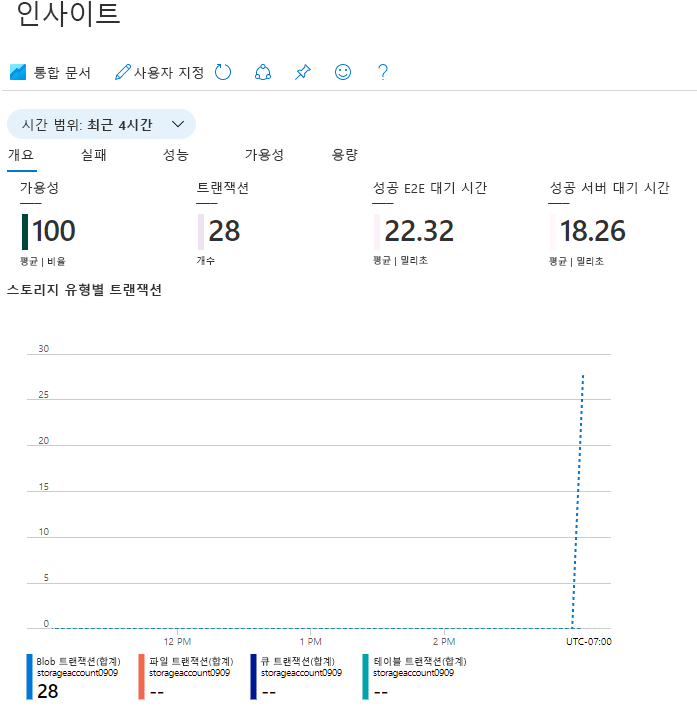

---
wts:
    title: '05 - Blob Storage 만들기(5분)'
    module: '모듈 02 - 핵심 Azure 서비스(워크로드)'
---
# 05 - Blob Storage 만들기

이 연습에서는 스토리지 계정을 만든 다음 Blob Storage 파일로 작업합니다.

# 작업 1: 스토리지 계정 만들기(5분)

이 작업에서는 새 스토리지 계정을 만듭니다. 

1. Azure Portal에 로그인합니다. <a href="https://portal.azure.com" target="_blank">https://portal.azure.com</a>

2. **모든 서비스** 블레이드에서 **스토리지 계정**을 검색하여 선택한 다음 **+ 추가**를 클릭합니다. 

3. **스토리지 계정 만들기** 블레이드의 **기본** 탭에서 다음 정보를 채웁니다(스토리지 계정 이름의 **xxxx**를 이름이 전역적으로 고유하도록 문자와 숫자로 대체). 다른 항목은 기본값을 사용합니다.

    | 설정 | 값 | 
    | --- | --- |
    | 구독 | **보유한 구독 선택** |
    | 리소스 그룹 | **myRGStorage**(새로 만들기) |
    | 스토리지 계정 이름 | **storageaccountxxxx** |
    | 위치 | **(미국) 미국 동부**  |
    | 성능 | **표준** |
    | 계정 종류 | **StorageV2(범용 v2)** |
    | 복제 | **로컬 중복 스토리지 (LRS)** |
    | | |

    **참고** - **xxxx** 를 고유한 **스토리지 계정 이름**으로 변경하는 것을 잊지 마세요.

5. **검토 + 만들기**를 클릭하여 스토리지 계정 설정을 검토하고 Azure에서 구성의 유효성을 검사할 수 있도록 허용합니다. 

6. 유효성 검사가 끝나면 **만들기**를 클릭합니다. 계정이 성공적으로 생성되었다는 알림을 기다립니다. 

7. 홈페이지에서 **스토리지 계정**을 검색하여 선택하고 새 스토리지 계정이 나열되어 있는지 확인합니다.

    

# 작업 2: Blob Storage 작업

이 작업에서는 Blob 컨테이너를 만들고 Blob 파일을 업로드합니다. 

1. 새 스토리지 계정의 이름을 클릭하고, **Blob 서비스** 섹션으로 스크롤한 다음 **컨테이너**를 클릭합니다.

2. **+컨테이너**를 클릭하고 정보를 작성합니다. 자세한 내용을 보려면 정보 아이콘을 사용합니다. 완료되면 **확인**을 클릭합니다.

    | 설정 | 값 |
    | --- | --- |
    | 이름 | **container1**  |
    | 공용 액세스 수준| **프라이빗(익명 액세스 없음)** |
    | | |

    

4. **container1** 컨테이너를 클릭한 다음 **업로드**를 클릭합니다.

5. 로컬 컴퓨터의 파일로 이동합니다. 

    **참고**: 빈 `.txt` 파일을 만들거나 기존 파일을 사용할 수 있습니다. 업로드 시간을 최소화하기 위해 작은 크기의 파일을 선택하는 것을 고려하세요.

6. **고급** 화살표를 클릭하고, 기본값을 그대로 두고 사용 가능한 옵션을 검토한 다음 **업로드**를 클릭합니다.

    **참고**: 이 방법으로 원하는 만큼 Blob을 업로드할 수 있습니다. 새 Blob은 컨테이너 내에 나열됩니다.

7. 파일이 업로드되면 파일을 마우스 오른쪽 단추로 클릭하고 보기/편집, 다운로드, 속성 및 삭제와 같은 옵션을 확인할 수 있습니다. 

8. 시간이 있으면 스토리지 계정 블레이드에서 파일, 테이블 및 큐에 대한 옵션을 검토합니다.

# 작업 3: 스토리지 계정 모니터링

1. 필요한 경우 스토리지 계정 블레이드로 돌아가서 **문제 진단 및 해결**을 클릭합니다. 

2. 가장 일반적인 스토리지 문제 중 일부를 살펴봅니다. 여러 개의 문제 해결사가 있습니다.

3. 스토리지 계정 블레이드에서 **모니터링** 섹션으로 스크롤하고 **인사이트**를 클릭합니다. 오류, 성능, 가용성 및 용량에 대한 정보가 있습니다. 표시되는 정보는 다를 수 있습니다.

    

축하합니다. 스토리지 계정을 만들고 스토리지 Blob을 사용하여 작업을 수행했습니다.

**참고**: 추가 비용을 방지하려면 이 리소스 그룹을 제거할 수 있습니다. 리소스 그룹을 검색하고 리소스 그룹을 클릭한 다음 **리소스 그룹 삭제**를 클릭합니다. 리소스 그룹의 이름을 확인한 다음 **삭제**를 클릭합니다. **알림**을 모니터링하여 삭제가 어떻게 진행되는지 확인합니다.
