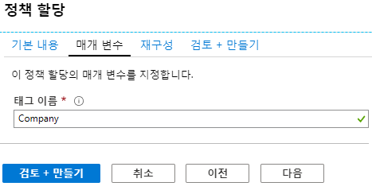
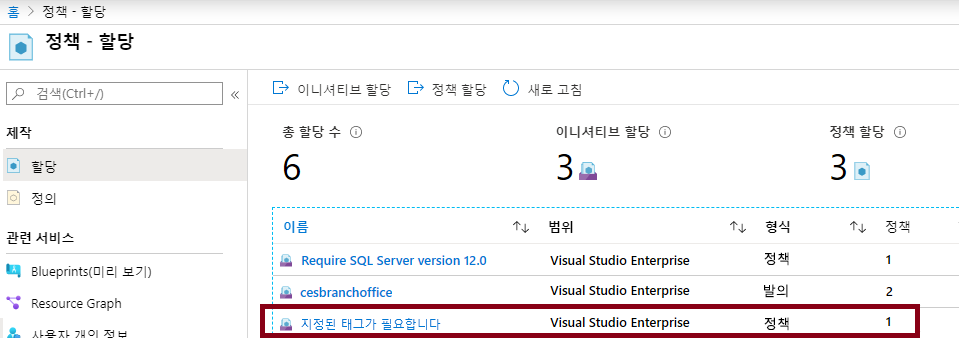
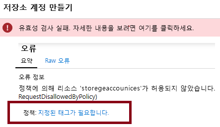
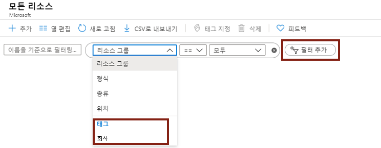

---
wts:
    title: '16 - 리소스 태그 지정 구현(5분)'
    module: '모듈 05: ID, 거버넌스, 개인 정보 및 규정 준수 기능에 대해 설명하기'
---
# 16 - 리소스 태그 지정 구현

이 연습에서는 태그 지정을 요구하는 정책 할당을 만들고, 스토리지 계정을 만들고, 태그를 테스트하고, 지정된 태그가 있는 리소스를 보고, 태그 지정 정책을 제거합니다.

# 작업 1: 정책 할당 만들기(5분)

이 작업에서는 **리소스에 태그 필요** 정책을 구성하고 구독에 할당합니다. 

1. [Azure Portal](https://portal.azure.com)에 로그인합니다.

2. **모든 서비스** 블레이드에서 **정책** 을 검색하고 선택합니다.

3. **작성** 섹션으로 스크롤하고, **할당** 을 클릭하고, 페이지 위쪽에서 **정책 할당** 을 클릭합니다.

4. 정책의 **범위** 는 구독 전체입니다. 

5. **정책 정의** 줄임표 단추(오른쪽 텍스트 상자의 끝)를 선택합니다. **태그** 값을 포함하는 정책 정의를 **검색** 하고, 결과 집합에서 **리소스에 태그 필요** 정의를 클릭한 다음 **선택** 을 클릭합니다.

   

6. **정책 할당** 블레이드의 **매개 변수** 탭에서 태그 이름에 대해 **Company** 를 입력합니다. **검토 + 만들기** 를 클릭하고 **만들기** 를 클릭합니다.

    **참고:** 다음은 태그 지정을 보여주는 간단한 예제입니다. 

    

7. 이제 **리소스에 태그 필요** 정책이 적용됩니다. 리소스가 생성될 때 Company 키가 있는 태그를 포함해야 합니다.

   

# 작업 2: 스토리지 계정을 만들어 필요한 태그 지정 테스트

이 작업에서는 스토리지 계정을 만들어 필요한 태그 지정을 테스트합니다. 

1. Azure Portal의 **모든 서비스** 블레이드에서 **스토리지 계정**을 검색하여 선택한 다음 **+ 추가** 를 클릭합니다.

2. **스토리지 계정 만들기** 블레이드의 **기본** 탭에서 다음 정보를 채웁니다(스토리지 계정 이름의 **xxxx** 를 이름이 전역적으로 고유하도록 문자와 숫자로 대체). 그 외 항목은 기본값으로 둡니다.

    | 설정 | 값 | 
    | --- | --- |
    | 구독 | **보유한 구독 사용** |
    | 리소스 그룹 | **myRGTags**(새로 만들기) |
    | 스토리지 계정 이름 | **storageaccountxxxx** |
    | 위치 | **(미국) 미국 동부** |
    | | |

3. **검토 + 만들기** 를 클릭합니다. 

    **참고:** 태그를 제공하지 않는 경우의 결과를 확인하기 위한 테스트를 수행하고 있습니다. 

4. 유효성 검사 실패 메시지를 받게 됩니다. **자세한 내용을 보려면 여기를 클릭하세요** 메시지를 클릭합니다. **오류** 블레이드의 **요약** 탭에서 리소스가 정책에 의해 금지되었다는 내용의 오류 메시지를 메모합니다.

    **참고:** Raw 오류 탭에는 필요한 특정 태그 이름이 표시됩니다. 

    

    **참고 - 태깅이 완료되도록 30분 기다려야 합니다.** 

5. **오류** 창을 닫고 **이전**(화면 아래쪽)을 클릭합니다. 태그 지정 정보를 제공합니다. 

    | 설정 | 값 | 
    | --- | --- |
    | 태그 이름 | **Company**(드롭다운 목록에 없을 수 있음) |
    | 태그 값 | **Contoso** |
    | | |

6. **검토 + 만들기**를 클릭하고 유효성 검사가 성공적이었는지 확인합니다. **만들기** 를 클릭하여 스토리지 계정을 배포합니다. 

# 작업 3: 특정 태그가 있는 모든 리소스 보기

1. Azure Portal의 **모든 서비스** 블레이드에서 **태그** 를 검색하고 선택합니다.

2. 모든 태그와 해당 값을 메모합니다. **Company: Contoso** 키/값 쌍을 클릭합니다. 배포 중에 태그를 포함했다면 새로 생성된 스토리지 계정을 보여주는 블레이드가 표시됩니다. 

   

3. Portal에서 **모든 리소스** 블레이드를 표시합니다.

4. **필터 추가** 를 클릭하고 **Company** 태그 키를 필터 범주로 추가합니다. 필터가 적용되면 스토리지 계정만 나열됩니다.

    

# 작업 4: 정책 할당 삭제

이 작업에서는 미래의 작업에 영향을 미치지 않도록 **리소스에 태그 필요** 정책을 제거합니다. 

1. 포털의 **모든 서비스** 블레이드에서 **정책** 을 검색하고 선택합니다.

2. **리소스에 태그 필요** 정책 항목을 클릭합니다.

3. 최상위 메뉴에서 **할당 삭제**를 클릭합니다.

4. **할당 삭제** 대화 상자에서 **예** 를 클릭하여 정책 삭제를 확인합니다.

5. 시간이 있으면 태그가 없는 다른 리소스를 만들어서 정책이 더 이상 적용되지 않는지를 확인합니다.

이 연습에서는 태그 지정을 요구하는 정책 할당을 만들고, 스토리지 계정을 만들고, 태그를 테스트하고, 지정된 태그가 있는 리소스를 보고, 태그 지정 정책을 제거했습니다.

**참고**: 추가 비용을 방지하려면 이 리소스 그룹을 제거할 수 있습니다. 리소스 그룹을 검색하고 리소스 그룹을 클릭한 다음 **리소스 그룹 삭제** 를 클릭합니다. 리소스 그룹의 이름을 확인한 다음 **삭제** 를 클릭합니다. **알림** 을 모니터링하여 삭제가 어떻게 진행되는지 확인합니다.
