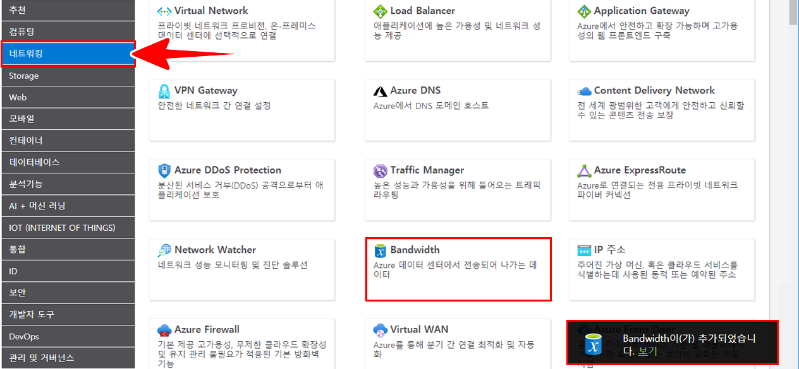
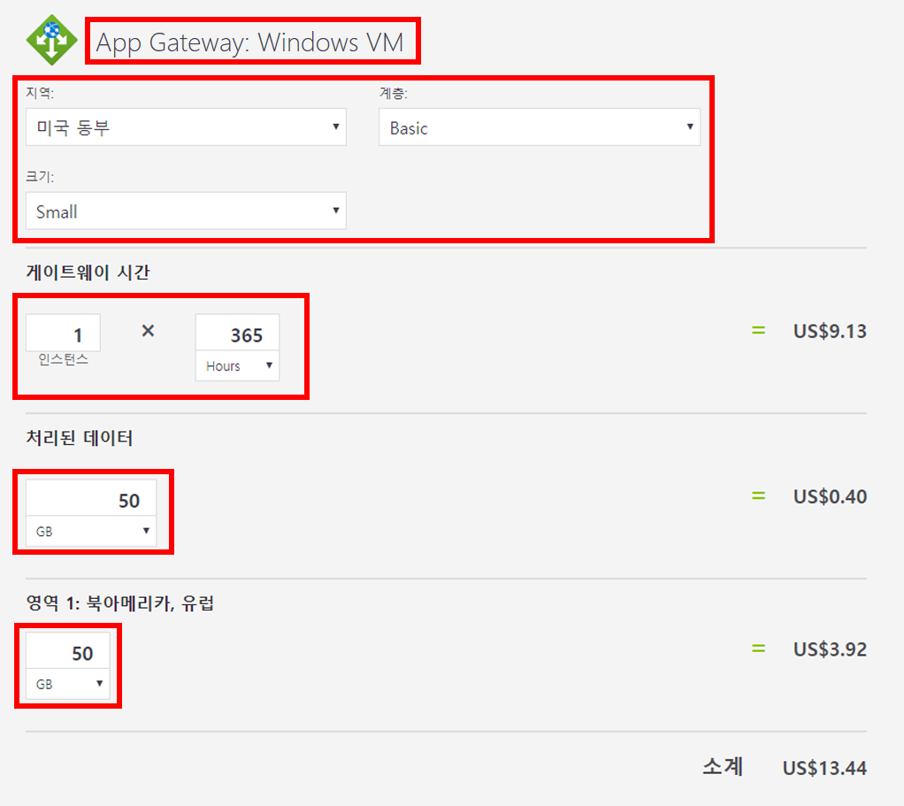
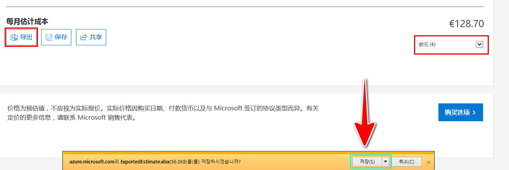
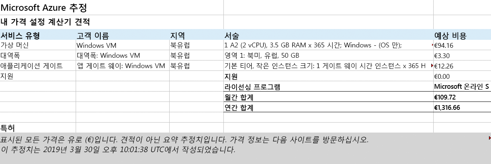

---
wts:
    title: '19 - Azure 가격 책정 계산기 사용(10분)'
    module: '모듈 06: Azure 비용 관리 및 서비스 수준 계약에 대해 설명하기'
---
# 19 - 가격 계산기 사용

이 연습에서는 Azure 가격 계산기를 사용하여 Azure 가상 머신 및 관련 네트워크 리소스에 대한 예상 비용을 생성합니다.

# 작업 1: 가격 계산기 구성(10분)

이 작업에서는 Azure 가격 계산기를 사용하여 샘플 인프라의 비용을 추산합니다. 

**참고**: Azure 가격 계산기 예상액을 만들기 위해 이 연습에서는 VM 및 관련 리소스에 대한 예제 구성을 제공합니다. 이 예제 구성을 사용하거나, Azure 가격 계산기에 *실제* 리소스 요구 사항의 세부 정보를 대신 제공합니다.

1. 브라우저에서 [Azure 가격 계산기](https://azure.microsoft.com/ko-kr/pricing/calculator/) 웹 페이지로 이동합니다.

2. VM 구성의 세부 정보를 추가하려면 **제품** 탭에서 **가상 머신** 을 클릭합니다. 아래로 스크롤하여 가상 머신 세부 정보를 봅니다. 

3. **예상값** 및 **가상 머신** 텍스트를 Azure 가격 계산기 예상값과 VM 구성에 대해 좀더 자세히 설명하는 이름으로 바꿉니다. 이 연습 예제에서는 예상액에 **내 가격 계산기 예상액** 을, VM 구성에 **Windows VM** 을 사용합니다.

   

4. 기본 VM 구성을 수정합니다.

    | 지역 | 운영 체제 | 유형 |
    |------|----------------|----|
    | 북유럽 | Windows | (OS 전용) |
    | | |

    | 계층 | 인스턴스 |
    |----|--------|
    | 표준 | A2: 2 코어, 3.5 GB RAM, 135 GB 임시 스토리지 |
    | | |

   

    **참고**: VM 인스턴스 사양 및 가격은 이 예제의 사양과 다를 수 있습니다. 예제와 가능한 한 가깝게 일치하는 인스턴스를 선택하여 이 연습을 따라 합니다. 다양한 VM 제품 옵션에 대한 세부 정보를 보려면 오른쪽의 **추가 정보** 메뉴에서 **제품 세부 정보** 를 선택합니다.

5. **청구 옵션** 을 **종량제** 로 설정합니다.

   

6. Azure에서 한 달은 730시간으로 정의됩니다. VM을 매월 100% 사용할 수 있어야 하는 경우에는 월별 시간 값을 `730`으로 설정합니다. 이 연습 예제에서는 한 VM이 매월 50%의 시간 동안 사용 가능해야 합니다.

    VM 수를 `1`로 설정하고 월별 시간 값을 `365`로 변경합니다.

   

7. **관리 OS 디스크** 창에서 기본 VM스토리지 구성을 수정합니다.

    | 계층 | 디스크 크기 | 디스크 수 | 스냅샷 | 스토리지 트랜잭션 |
    | ---- | --------- | --------------- | -------- | -------------------- |
    | 표준 HDD | S30: 1024 GiB | 1 | 꺼짐 | 10,000 |

   

8. 견적에 네트워킹 대역폭을 추가하려면 Azure 가격 계산기 웹 페이지의 상단으로 이동하십시오. 왼쪽의 제품 메뉴에서 **네트워킹** 을 클릭한 다음 **대역폭** 타일을 클릭합니다. **추가된 대역폭** 메시지 대화 상자에서 **보기** 를 클릭합니다.

   

9. VM 대역폭 구성의 이름을 추가합니다. 이 연습 예제에서는 **대역폭: Windows VM** 이름을 사용합니다. 다음 세부 정보를 추가하여 기본 대역폭 구성을 수정합니다.

    | 지역 | 영역 1 아웃바운드 데이터 전송 양 |
    | ------ | -------------------------------------- |
    | 북유럽 | 50 GB |

   

10. Application Gateway를 추가하려면 Azure 가격 계산기 웹 페이지의 맨 위로 돌아갑니다. **네트워킹** 제품 메뉴에서 **Application Gateway** 타일을 클릭합니다. **Application Gateway** 메시지 대화 상자에서 **보기** 를 클릭합니다.

    

11. Application Gateway 구성의 이름을 추가합니다. 이 연습에서는 **App Gateway: Windows VM** 이름을 사용합니다. 다음 세부 정보를 추가하여 기본 Application Gateway 구성을 수정합니다.

    | 지역 | 계층 | 크기 |
    | ------ | ---- | ---- |
    | 북유럽 | 기본 | 소형 |
    | | |

    | 인스턴스 | 시간 |
    | ------- | ------- |
    | 1 | 365 |
    | | |

    | 처리된 데이터 |
    | -------------- |
    | 50 GB |
    | | |

    | 영역 1: 북미, 유럽 |
    | ----------------------------- |
    | 50 GB |
    | | |

    

# 작업 2: 예상 가격 검토

이 작업에서는 Azure 가격 계산기의 결과를 검토합니다. 

1. Azure 가격 계산기 웹 페이지의 아래쪽으로 스크롤하고 총 **예상 월별 비용**을 봅니다.

    **참고**: Azure 가격 계산기에서 사용할 수 있는 다양한 옵션을 살펴봅니다. 예를 들어 이 연습에서는 통화를 유로로 업데이트해야 합니다.

2. 통화를 유로로 변경한 다음 **내보내기** 를 선택하여 Microsoft Excel(`.xlsx`) 형식으로 오프라인으로 볼 수 있는 예상액의 복사본을 다운로드합니다.

    

    

축하합니다. Azure 가격 계산기에서 예상액을 다운로드했습니다.